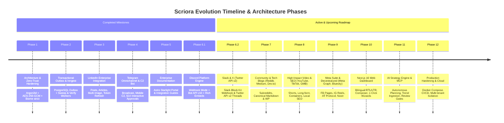

# 🗺️ Scriora Master Roadmap: Historical Milestones, Future Phases & Competitor Parity

> **Project:** Scriora — The Growth Operating System for Content Teams  
> **Core Architecture:** Turborepo + pnpm Monorepo, Fastify API Gateway, PostgreSQL + Prisma, Inngest Background Queue, AES-256-GCM Envelope Encryption.  
> **Governance Standard:** Zero-Trust Security & §14 Human-in-the-Loop Interactive Approvals.  
> **Market Parity:** Benchmarked against **Buffer**, **Postiz**, **Ayrshare**, and **Hootsuite**.

---

## 🧭 Executive Summary

Scriora is designed as an enterprise-grade, centralized Growth Operating System for managing, scheduling, orchestrating, and broadcasting content across all major global social platforms, community hubs, technical blogs, and Web3 networks. It combines an autonomous AI content strategist with strict **Human Governance (§14)** to ensure quality, compliance, and brand safety before any post goes live.

---

## 🏆 Part 1: Completed Historical Milestones

### 📌 Phase 1: Architectural Scaffolding & Zero-Trust Hardening
* **Status:** 100% Completed & Verified ✅
* **Delivered Capabilities:**
  1. Monorepo consolidation across packages (`packages/core`, `packages/social`, `apps/api`, `apps/worker`, `apps/docs`, `apps/web`).
  2. Cryptographic elevation: password hashing migrated to standard **Argon2id**, JWT validation strictly enforced.
  3. **AES-256-GCM Envelope Encryption** implemented in `secret_envelopes` table with dynamic 96-bit IVs and 128-bit authentication tags.
  4. Repository-wide strict linting: enabled `noExplicitAny: error` in `biome.json` with zero compiler bypasses.
  5. Container infrastructure repaired: Dockerfiles standardized for multi-stage production builds.

### 📌 Phase 2: Transactional Outbox Pipeline & Distributed Workers
* **Status:** 100% Completed & Verified ✅
* **Delivered Capabilities:**
  1. Built **Transactional Outbox Pattern** in PostgreSQL (`outbox_commands`, `publish_attempts`) guaranteeing zero lost posts.
  2. Orchestrated background execution via **Inngest** (`outbox-sweep.job.ts`, `publish.job.ts`, `verify.job.ts`).
  3. Integrated exponential backoff and automatic retry policies for rate-limited platforms.
  4. Independent post-publication verification loop verifying remote external states on target social platforms.

### 📌 Phase 3: LinkedIn Enterprise Adapter
* **Status:** 100% Completed & Verified ✅
* **Delivered Capabilities:**
  1. Full `LinkedInAdapter` compliant with `PlatformContract` interface and OAuth 2.0 PKCE.
  2. Multi-format support: long-form articles, single/multi-image posts, rich link cards, and PDF carousels.
  3. Automated background token refresh prior to 60-day token expiration.
  4. Live verification of post publication, metrics ingestion, and remote deletion.

### 📌 Phase 4: Telegram Omnichannel Broadcast & C2 Admin Bot
* **Status:** 100% Completed & Verified ✅
* **Delivered Capabilities:**
  1. **Omnichannel Broadcast:** Concurrent multi-target publishing across Private 1:1 Chats, Public Channels (`@handle`), Private Channels (`-100...`), and Supergroups/Forums.
  2. **Rich Media Support:** High-resolution photo uploads with HTML/MarkdownV2 captions.
  3. **C2 Mobile Admin Bot (`TelegramBotService`):**
     * Zero-Trust Whitelist perimeter restricted to authorized admin user ID.
     * Mobile telemetry commands: `/status`, `/accounts`, `/post [content]`.
  4. **Two-Way Human Governance (§14 Interactive Approvals):**
     * Dispatches interactive approval cards to the owner's mobile Telegram.
     * Fully customizable message header, footer, body template, and inline button labels (e.g. `[ 🚀 Publish Now ]` / `[ 🛑 Postpone ]`).
     * Real-time message update reflecting decision outcome, timestamp, and reviewer handle.
     * Direct PostgreSQL outbox trigger: marks `PUBLISHED` and dispatches immediately on approval; marks `CANCELLED` on rejection.
  5. **Least-Privilege Privacy Policy:**
     * Requires ONLY "Post Messages" for channels and "Send Messages" for groups.
     * Zero message reading (Group Privacy Mode enabled), zero admin management, zero contact access.

### 📌 Phase 5: Enterprise Documentation & Developer Portal
* **Status:** 100% Completed & Verified ✅
* **Delivered Capabilities:**
  1. Complete integration specifications in `docs/integrations/TELEGRAM_INTEGRATION_GUIDE.md` and `docs/integrations/PLATFORMS_ROADMAP.md`.
  2. Deployed Astro Starlight documentation site in `apps/docs`.
  3. Clean git history permanently purged of secrets and synchronized with `origin/main`.

### 📌 Phase 6.1: Discord Platform Integration (Webhooks & Bot API)
* **Status:** 100% Completed & Verified ✅
* **Delivered Capabilities:**
  1. Built `DiscordAdapter` implementing dual-mode publishing:
     - **Incoming Webhooks Mode:** 10-second instant setup by pasting channel webhook URL.
     - **Bot API Mode (v10):** Channel posting with `Authorization: Bot <token>`.
  2. **Rich Embeds & Multi-Image:** Custom colors (hex `#5865F2`), titles, descriptions, footers, and album multi-image attachments (up to 4 images per embed).
  3. **Error Normalization:** Graceful translation of Discord 400, 401, 404, and 429 rate limits (with dynamic `retryAfterMs`).
  4. **Core Schema & Prisma Alignment:** `DISCORD` added to `SocialPlatform` enum, `publish.schema.ts`, and `platformRegistry`.
  5. **Triple Gate Verification:** 11/11 tests passed in `discord.adapter.test.ts`, 100% pass across entire monorepo.

---

## 🚀 Part 2: Active & Upcoming Roadmap Phases

---

### 🟢 Phase 6.2: Slack & X (Twitter API v2) Activation
* **Goal:** Complete the Zero-Friction Community & Instant Publishing Tier.
* **1. Slack Adapter:**
  * Incoming Webhook URL publishing (instant team channel broadcasts).
  * Slack App Bot Token (`chat:write`) with Block Kit JSON formatting.
* **2. X (Twitter) Activation:**
  * Twitter API v2 integration with OAuth 2.0 PKCE (already coded in `XAdapter`).
  * Automated Long-form Tweet Threading (splits long posts into numbered threads).
  * Chunked media upload for images, GIFs, and MP4 videos.

---

### 🟢 Phase 7: Technical Blogs, CMS & Developer Communities
* **Goal:** Authority marketing and technical cross-posting.
* **1. Reddit Adapter:** Subreddit post publishing via OAuth 2.0 Script App.
* **2. Developer Blogging (Medium, Dev.to, Hashnode):**
  * Long-form Markdown publishing with canonical SEO link attribution.
* **3. WordPress Integration:** Direct publishing via WordPress REST API and Application Passwords.
* **4. Decentralized Microblogging (Bluesky & Mastodon):**
  * Bluesky AT Protocol via App Passwords.
  * Mastodon ActivityPub REST via Personal Access Tokens.

---

### 🟢 Phase 8: High-Impact Video, Local SEO & Newsletters
* **Goal:** Distribution across short-form viral video, search engines, and broadcast lists.
* **1. YouTube Integration (Google Data API v3):**
  * Native YouTube Shorts and Long-form video with resumable chunked upload.
* **2. TikTok Content Posting API:** Direct share short-form 9:16 video.
* **3. Google Business Profile (GMB):** Local SEO updates, promotional offers, and business photos.
* **4. WhatsApp Channels & Listmonk:** Broad-reach direct broadcast newsletters.

---

### 🟢 Phase 9: Meta Visual Suite & Web3 Networks
* **Goal:** Enterprise social graph publishing and decentralized networks.
* **1. Facebook Pages & Groups:** Meta Graph API v20+ with Business Verification.
* **2. Instagram Business/Creator:** 2-phase Container Publishing (`/media` -> `/media_publish`).
* **3. Pinterest API v5:** Visual boards and pins with destination URLs.
* **4. Web3 / Fediverse Hub:** Warpcast (Farcaster), Nostr relays, Lemmy, Twitch, Kick, Skool.

---

### 🟢 Phase 10: Modern Next.js 16 Web Dashboard & User Onboarding
* **Goal:** World-class web experience supporting seamless Arabic (RTL) and English (LTR) workflows.
* **Core Deliverables:**
  1. **1-Click Connection Wizard:** Visual step-by-step connection flow for every platform with live connection tests.
  2. **Visual Content Calendar:** Drag-and-drop monthly/weekly post scheduling.
  3. **Omnichannel Composer:** Unified post editor with real-time multi-platform previews.
  4. **Human Governance Hub (§14):** Team-wide approval dashboard for managers and editors.

---

### 🟢 Phase 11: Autonomous AI Content Strategist & MCP Tools
* **Goal:** Transform Scriora from a scheduler into an autonomous growth engine.
* **Core Deliverables:**
  1. **Autonomous Growth Agent:** Monthly content calendar generation aligned with brand voice and audience personas.
  2. **Strict Human Gate (§14):** AI proposals strictly held in draft state until verified by a human reviewer.
  3. **MCP Server Integration:** Model Context Protocol tools for live trend scraping, competitor teardown, and SEO optimization.
  4. **Unified Comments & DM Inbox:** Centralized community inbox for Instagram, Facebook, and Threads comments.

---

### 🟢 Phase 12: Production Hardening, Self-Hosting & Deployment Gate
* **Goal:** Enterprise self-hosting and multi-tenant SaaS readiness.
* **Core Deliverables:**
  1. Production Docker Compose bundle (`scriora-cloud`).
  2. Row Level Security (RLS) tenant data isolation in PostgreSQL.
  3. Automated CI/CD pipelines with dependency auditing, CodeQL, and zero-downtime deployment gates.

---

## 📋 Master Milestone Execution Matrix

| Phase | Domain / Scope | Core Technologies | Completion Status |
|---|---|---|:---:|
| **Phase 1** | Architecture & Security Hardening | Argon2id + AES-256-GCM + Biome | **100% ✅** |
| **Phase 2** | Transactional Outbox & Workers | PostgreSQL + Inngest + Prisma | **100% ✅** |
| **Phase 3** | LinkedIn Enterprise Adapter | OAuth 2.0 PKCE + REST API | **100% ✅** |
| **Phase 4** | Telegram Omnichannel & C2 Bot | Bot API + Interactive Webhooks | **100% ✅** |
| **Phase 5** | Enterprise Documentation | Astro Starlight + Mermaid Docs | **100% ✅** |
| **Phase 6.1** | Discord Platform Engine | Webhooks + Bot API v10 + Embeds | **100% ✅** |
| **Phase 6.2** | Slack & X (Twitter API v2) | Slack Block Kit + Twitter API v2 | **🚀 In Progress (Next)** |
| **Phase 7** | Tech Blogs & Communities (Reddit, Medium, WP) | REST APIs + Markdown + AT Protocol | **0% ⏳** |
| **Phase 8** | Video Hub & SEO (YouTube, TikTok, GMB) | Resumable Uploads + Google API | **0% ⏳** |
| **Phase 9** | Meta Suite & Web3 (Facebook, IG, Nostr) | Meta Graph API + Warpcast | **0% ⏳** |
| **Phase 10** | Next.js 16 Web Dashboard | React 19 + Tailwind v4 + RTL/LTR | **0% ⏳** |
| **Phase 11** | AI Strategy Engine & MCP | Claude/Cursor MCP + Agent Workflows | **0% ⏳** |
| **Phase 12** | Production Cloud & Deployment | Docker + GitHub Actions + RLS | **0% ⏳** |
