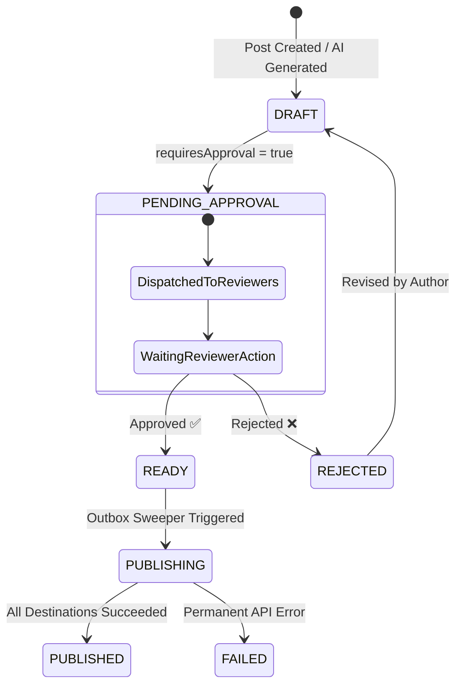

# 🛡️ Human-in-the-Loop Content Approval Flow (Governance §14)

Scriora provides enterprise teams with rigorous **Human Governance (§14)** to ensure no AI-generated draft or team post is published without authorized human validation.

---

## 1. 🧭 The Approval Lifecycle

Every publication requiring review progresses through a deterministic, auditable state machine:

---

## 2. 📱 Multi-Channel Interactive Approvals

Reviewers can inspect drafts, view attached media mockups, and issue binding approval decisions directly from their preferred interface:

### A. Telegram C2 Admin Bot (Mobile 1-Tap)
* An interactive card is delivered to the authorized administrator's Telegram chat.
* Features **Inline Keyboard Buttons**: `[ 🚀 Approve & Publish ]` and `[ 🛑 Reject Draft ]`.
* Upon tapping, the token is verified, consumed, and the message edits in-place to confirm: `✅ Approved by @Admin at 14:22 UTC`.

### B. Discord Interactive ActionRow Buttons
* A rich embed is sent to the designated `#scriora-approvals` channel on your private Discord server.
* Equipped with Discord **Message Components (Buttons)**:
  - **Success Button (Green):** `Approve & Publish ✅`
  - **Danger Button (Red):** `Reject Draft ❌`
  - **Link Button (Grey):** `View in Scriora 🌐`
* Button clicks are verified via **Ed25519** signature verification on `POST /v1/webhooks/discord/interactions`.

### C. Web Dashboard Approvals Queue
* Access `/dashboard/approvals` to view side-by-side omnichannel previews:
  - See exact rendering on LinkedIn feed, Discord rich embed, and Telegram channel.
  - Approve single targets or bulk-approve multi-channel campaigns with one click.

---

## 3. 🔐 Cryptographic Security & Token Lifecycle

* **Single-Use Tokens:** Each approval request generates a unique, cryptographically secure approval token.
* **Expiration Window:** Tokens expire automatically after **72 hours**.
* **Audit Trail:** Every decision records the reviewer ID, timestamp, and decision note in the PostgreSQL audit log for compliance.
