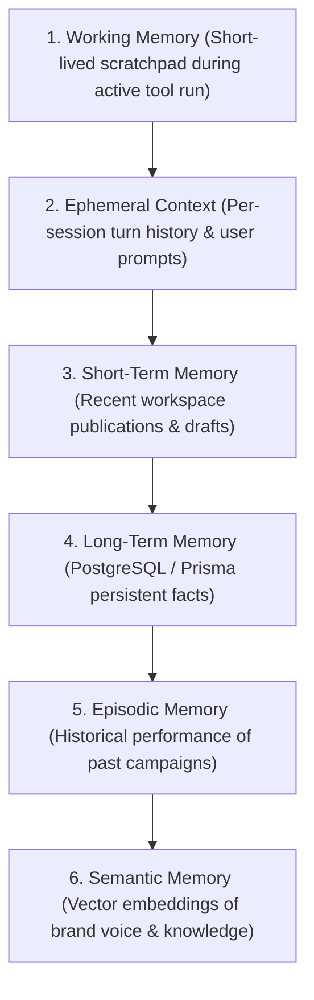

Scriora's AI Agent Engine (`@scriora/agent`) is an autonomous, goal-oriented system designed for automated social orchestration, content strategy, community engagement, and predictive scheduling.

---

## 🧠 6-Tier Memory Architecture

To prevent context drift and ensure enterprise-grade reliability, the agent utilizes a 6-tier hierarchical memory model:

1. **Working Memory**: In-memory execution state during a multi-step loop.
2. **Ephemeral Context**: Current conversation or autonomous mission execution session.
3. **Short-Term Memory**: Recent drafts, pending reviews, scheduled queue.
4. **Long-Term Memory**: Workspace facts, team members, connected platform configurations.
5. **Episodic Memory**: Past post performance data, engagement anomalies, lessons learned.
6. **Semantic Memory**: Brand voice vectors, stylistic archetypes, topic guidelines.

---

## 🎚️ Autonomy Levels (L0 - L4)

The agent operates under strict **Autonomy Levels** configured per workspace:

| Level | Name | Behavior | Human-in-the-Loop |
|---|---|---|---|
| **L0** | Manual Assistant | Generates drafts upon explicit prompt only. | 100% human approved. |
| **L1** | Assisted Scheduling | Suggests optimal times and formats drafts. | Human must click "Schedule". |
| **L2** | Conditional Auto-Publish | Publishes low-risk routine posts; flags high-impact ones for review. | Exception-based human approval. |
| **L3** | Supervised Autonomy | Executes scheduled campaigns autonomously; notifies human via digest. | Asynchronous human review. |
| **L4** | Full Autonomy | Autonomous strategy, content generation, posting, and analytics response. | Strategic human oversight only. |

---

## 🛡️ Guardrails & Safety Loop

- **Prompt Injection Defense**: All user inputs and external social webhook contents are sanitized before feeding into LLM context.
- **Budget Capping**: Token consumption and tool invocation limits per mission prevent infinite runaway execution.
- **Content Policy Verification**: Built-in deterministic regex and sentiment filters check for compliance with brand guidelines before dispatching to the Outbox.
