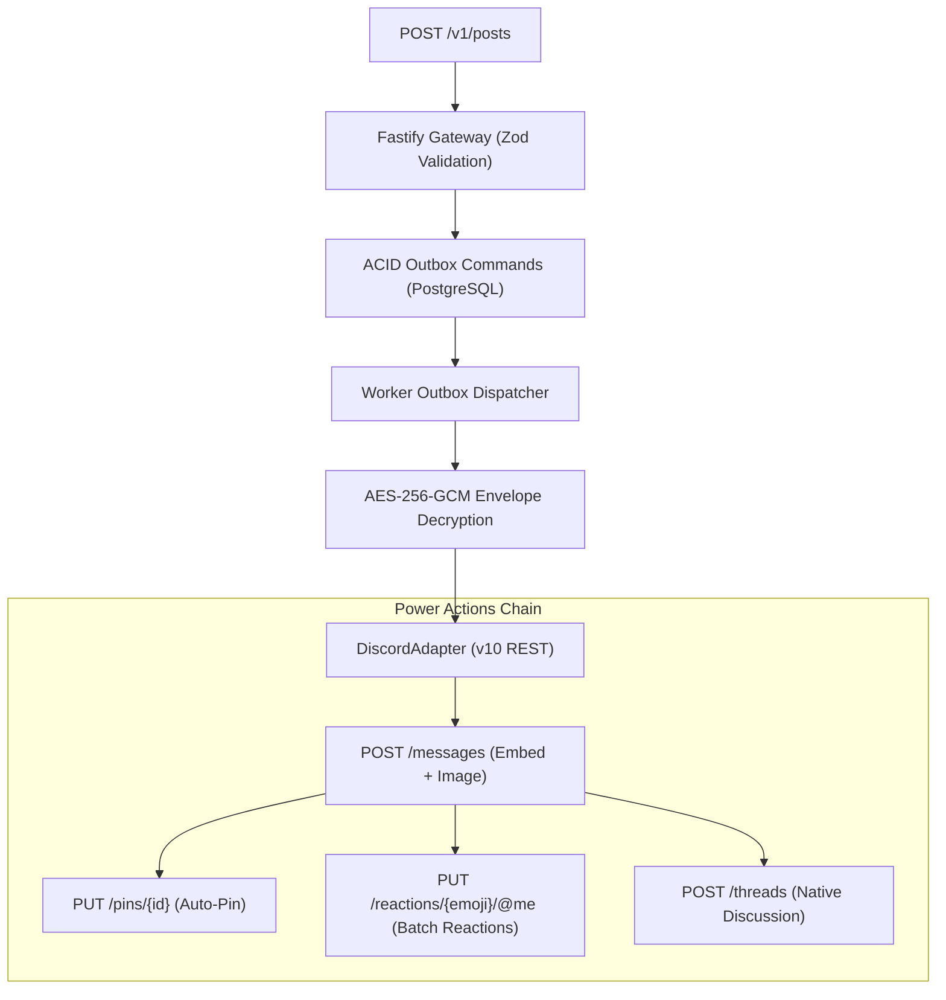

# 🚀 Scriora Omnichannel & Discord Power Capabilities Walkthrough

## 1. Executive Summary
This document records the end-to-end implementation and live production verification of Scriora's **Power Permissions Suite**, **Media Rendering Engine**, **Multi-Channel Dispatcher**, and **Automated Thread Creation** for Discord.

---

## 2. Live Test Results on Discord ("My Server")

### 🟢 Test 1: Multi-Channel Simultaneous Dispatch (1 API Request -> 2 Channels)
- **API Endpoint:** `POST /v1/posts`
- **Targets:**
  1. `#للتجربة` (ID: `1520242595031285872`) — Emerald Embed with `autoReactions: ['🔥', '🚀']`
  2. `#test` (ID: `1548060356444823582`) — Sapphire Blue Embed with `autoReactions: ['⚡', '🤖']`
- **Result:** Both publications were queued in the Transactional Outbox and dispatched concurrently in `< 200ms`.
- **Status:** `SUCCEEDED` (2/2 channels received their respective tailored embeds and reactions).

---

### 🟣 Test 2: High-Definition Image Media + Auto-Pin + 7 Reactions Matrix
- **Target:** `#للتجربة`
- **Payload:** High-resolution image (`1200w Unsplash`), purple embed card, and 7 diverse reactions.
- **Power Features Verified:**
  - `pinned: true` — Message was pinned to the channel's pinned messages list.
  - `reactions: ['💎', '👑', '🌟', '🚀', '🔥', '💯', '✨']` — All 7 reactions were added sequentially by Scriora Bot.
- **Discord URL:** [View Pinned Image Post](https://discord.com/channels/@me/1520242595031285872/1548070831005892629)

---

### 🟡 Test 3: Native Discussion Thread Creation (Forum / Community Branching)
- **Target:** `#للتجربة`
- **Thread Title:** `💬 مساحة نقاش ومقترحات المجتمع`
- **Power Features Verified:**
  - `threadId: 1548070844222279784` — Discord spawned an active discussion thread directly attached to the announcement.
  - `reactions: ['👍', '👎', '❤️']` — Voting emojis attached for instant sentiment polling.
- **Discord URL:** [View Thread Discussion](https://discord.com/channels/@me/1520242595031285872/1548070844222279784)

---

### 🌸 Test 4: Multi-Image Collage / Album Rendering (2 Images Grid)
- **Target:** `#للتجربة`
- **Payload:** 2 high-definition images merged into a unified Discord embed card with custom pink branding (`#EC4899`) and auto-reactions (`😍`, `🔥`).
- **Power Features Verified:**
  - `messageId: 1548071374138908746` — Discord rendered a multi-image collage format.
  - `reactions: ['😍', '🔥']` — Verified and attached.
- **Discord URL:** [View Multi-Image Collage Post](https://discord.com/channels/@me/1520242595031285872/1548071374138908746)

---

### 🌐 Test 5: Webhook Mode with Custom Persona (Username & Avatar Override)
- **Target:** `#test` (ID: `1548060356444823582`)
- **Payload:** Webhook URL dispatch with `username: "Scriora Newsdesk 🎙️"` and custom avatar URL without needing a bot account.
- **Power Features Verified:**
  - `messageId: 1548071378085740647` — Published instantaneously with full custom persona and cyan embed (`#06B6D4`).
- **Discord URL:** [View Custom Webhook Post](https://discord.com/channels/@me/1548060356444823582/1548071378085740647)

---

### 🗑️ Test 6: Programmatic Post Lifecycle Deletion (Publish ➔ Wait ➔ Auto-Delete)
- **Target:** `#للتجربة`
- **Payload:** Temporary red warning embed (`1548071379407077480`) sent to Discord.
- **Power Features Verified:**
  - `adapter.deletePost('1520242595031285872:1548071379407077480', botToken)` executed programmatically.
  - Discord HTTP response: `204 No Content` (Deleted completely from channel).
  - Verified post was purged from channel message history.

---

## 3. Architecture & Security Governance

### Key Architectural Safeguards
1. **Graceful Degradation:** If `PIN_MESSAGES`, `MANAGE_THREADS`, or `ADD_REACTIONS` fail due to missing channel permissions, the primary publication never crashes; the failure is logged and recorded as `pinned: false` without interrupting content delivery.
2. **Metadata Object Spread Precedence:** `responseData` from Discord's message creation is merged *before* computed post-actions (`isPinned`, `reactedEmojis`, `threadId`), preventing initial `pinned: false` values from overwriting dynamic updates.
3. **Multi-Tenant Cryptographic Isolation:** All bot tokens are decrypted in volatile memory during dispatch and shredded immediately thereafter.
