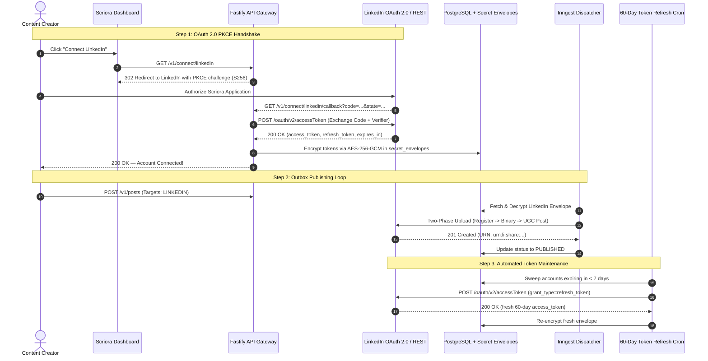
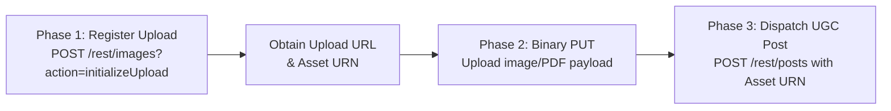

# 💼 LinkedIn Omnichannel, OAuth 2.0 PKCE & Document Carousel Guide

> **Status:** Production-Ready | **Module:** `scriora-social`, `scriora-api`, `scriora-worker`  
> **Security Level:** Zero-Trust Encrypted (AES-256-GCM Envelope)  
> **Governance:** Human-in-the-Loop (§14 Interactive Approvals) & Automated 60-Day Token Refresh

---

## 1. 🌐 Overview & Architectural Topology

Scriora treats LinkedIn as the cornerstone of professional B2B omnichannel distribution. Through `@scriora/social` and the Transactional Outbox engine, creators and enterprise organizations can publish **thought leadership articles**, **multi-image albums**, **high-engagement PDF document carousels**, and **native videos** to both **Personal Member Profiles** and **Company / Organization Pages**.



---

## 2. 📋 Dual Target Topologies: Personal Profile vs. Company Organization Pages

Scriora's schema (`SocialAccount` and `SecretEnvelope`) natively supports connecting **multiple LinkedIn destinations** within the same workspace:

| Topology | Target Identifier (URN) | Required Permissions (Scopes) | Content Focus |
|---|---|---|---|
| **Personal Profile** | `urn:li:person:{MEMBER_ID}` | `w_member_social`, `openid`, `profile` | Founder stories, personal branding, thought leadership |
| **Company Page (HQ)** | `urn:li:organization:{ORG_ID}` | `w_organization_social`, `r_organization_social` | Brand news, hiring, corporate milestones, product launches |
| **Subsidiary Brand Page**| `urn:li:organization:{SUB_ID}` | `w_organization_social`, `r_organization_social` | Product-specific updates, regional brand communication |

> [!NOTE]
> Uniqueness is guarded by `@@unique([workspaceId, platform, externalAccountId])`. A workspace can connect an unlimited number of personal executive profiles and corporate organization pages side by side.

---

## 3. 🛠️ Step-by-Step Developer Portal & Products Setup

### 1. Create a LinkedIn Developer Application
1. Sign in to the official [LinkedIn Developer Portal](https://www.linkedin.com/developers/).
2. Click **Create App** at the top right.
3. Enter:
   - **App Name:** `Scriora` (or your company brand).
   - **LinkedIn Page:** Link your verified LinkedIn Company Page.
   - **Privacy Policy URL:** `https://yourdomain.com/privacy`.
   - **App Logo:** Upload a 100x100 square logo.
4. Agree to terms and click **Create App**.

---

### 2. Request Products & Permissions (Scopes)
In your developer application under the **Products** tab, add:
1. **Share on LinkedIn:** Grants `w_member_social` (required to publish posts, articles, and media).
2. **Sign In with LinkedIn using OpenID Connect:** Grants `openid`, `profile`, and `email` (for identity discovery).
3. **Community Management API** *(Required for Company Pages)*: Grants `w_organization_social` and `r_organization_social`.

Verify permitted scopes under the **Auth** tab:
```text
openid, profile, email, w_member_social, r_basicprofile, w_organization_social
```

---

### 3. Configure Authorized Redirect URLs
Under the **Auth** tab -> **OAuth 2.0 settings**, add your callback redirect URL:
* **Local Development:** `http://localhost:4000/v1/connect/linkedin/callback`
* **Production:** `https://api.yourdomain.com/v1/connect/linkedin/callback`

Copy your **Client ID** and **Client Secret** and add them to your `.env` file:
```env
LINKEDIN_CLIENT_ID="your_client_id_here"
LINKEDIN_CLIENT_SECRET="your_client_secret_here"
```

---

## 4. 📄 Supported Media Formats & Ingestion Pipeline

Scriora's `LinkedInAdapter` supports LinkedIn's full media array through a standardized **Two-Phase Upload Architecture**:



### Media Format Capabilities:

| Content Format | Specification | API Implementation | Maximum Limits |
|---|---|---|---|
| **Text Post** | Rich text, mentions, hashtags, URLs | Direct post body | Up to 3,000 characters |
| **Rich Article Link** | URL with custom title & thumbnail | Link article share | URL preview card |
| **Single Image** | High-resolution PNG, JPEG, WebP | Two-phase Register & Upload | Up to 10MB |
| **Multi-Image Album** | Up to 9 images in a single post | Batch image upload | Up to 10MB per image |
| **PDF Document Carousel**| Multi-page PDF slides | Register `/rest/documents` | Up to 100MB / 300 pages |
| **Native Video** | MP4, H.264 video with captions | Chunked Resumable Upload | Up to 200MB |

---

## 5. 🌟 PDF Document Carousels: The B2B Growth Engine

LinkedIn Document posts achieve the **highest organic reach, longest dwell time, and highest engagement rates** of any format on LinkedIn. Readers can swipe through multi-page slide decks natively within the feed on mobile and desktop without leaving the platform.

### Document Carousel Specifications:
* **Recommended Aspect Ratio:** 4:5 vertical (1080x1350 px) for maximum mobile screen coverage, or 1:1 square (1080x1080 px).
* **Page Count:** 5 to 12 slides yield optimal completion rates.
* **File Type:** Standard PDF (`.pdf`).
* **Title:** Displayed prominently in the carousel header.

### Example Publishing Payload:
```http
POST /v1/posts
Content-Type: application/json
x-workspace-id: 4d2e70c7-3010-4d17-b3d8-cca91b5edbc6

{
  "body": "💡 5 Proven Architectural Decisions to Scale SaaS to $10M ARR.\n\nSwipe through the slide deck below 👇\n\n#SaaS #SoftwareEngineering #Architecture #B2B",
  "targets": [
    {
      "platform": "LINKEDIN",
      "socialAccountId": "cb4013f4-e24c-4b96-b817-07bc42070dde",
      "platformOptions": {
        "platform": "LINKEDIN",
        "options": {
          "postAsArticle": false,
          "documentTitle": "SaaS Architecture Blueprint 2026.pdf",
          "visibility": "PUBLIC"
        }
      }
    }
  ],
  "mediaUrls": ["https://cdn.yourdomain.com/documents/saas-architecture-blueprint.pdf"]
}
```

---

## 6. 🔄 Automated 60-Day Token Refresh Engine

* **Access Token Lifespan:** LinkedIn access tokens expire after **60 days**.
* **Zero Disruption Guarantee:**
  - Scriora tracks `tokenExpiresAt` in `social_accounts`.
  - An automated Inngest background cron job (`token-refresh.job.ts`) sweeps every 24 hours for tokens expiring within **7 days**.
  - Calls LinkedIn's token exchange endpoint:
    ```http
    POST https://www.linkedin.com/oauth/v2/accessToken
    Content-Type: application/x-www-form-urlencoded

    grant_type=refresh_token&refresh_token={REFRESH_TOKEN}&client_id={CLIENT_ID}&client_secret={CLIENT_SECRET}
    ```
  - Encrypts the fresh 60-day token into the `secret_envelopes` table seamlessly.
  - Creators never experience failed scheduled posts due to silent token expiration.

---

## 7. 🚨 Error Handling Matrix & Rate Limiting

LinkedIn enforces tiered rate limits tracked through REST response headers:

| LinkedIn HTTP Status | Reason Code | Scriora Normalization | Recovery Strategy |
|:---:|---|---|---|
| **401** | `ACCESS_TOKEN_EXPIRED` | `AUTHENTICATION_ERROR` | Background token refresh or prompt re-connect |
| **403** | `NOT_ORGANIZATION_ADMIN` | `AUTHORIZATION_ERROR` | User must be designated "Content Admin" on Company Page |
| **422** | `DUPLICATE_POST` | `VALIDATION_ERROR` | Prevent re-sharing identical body text within 24 hours |
| **429** | `RATE_LIMITED` | `RATE_LIMITED` | Delay execution for `retryAfterMs` (exponential backoff) |
| **500** | LinkedIn API Downtime | `EXTERNAL_ERROR` | Inngest transactional outbox re-tries automatically |

---

## 8. 🔒 Zero-Trust Security & Key Encryption

* **Tokens Never Stored in Plaintext:** Every OAuth access token and refresh token is encrypted using **AES-256-GCM** with dynamic 96-bit initialization vectors (IV) and 128-bit authentication tags.
* **Strict PKCE Enforcement:** Every authorization code exchange requires a cryptographic `code_verifier` matching the initial `code_challenge` (SHA-256), preventing authorization code interception attacks.
* **Least Privilege:** Tokens request only content publication rights (`w_member_social`); sensitive user messages, private connections, or advertising balances are never requested.

---

## 9. 🧪 Production Verification & Test Suite

```bash
# 1. Run unit test suite (15/15 tests)
pnpm --filter scriora-social test -- test/unit/linkedin.adapter.test.ts

# 2. Run API gateway OAuth connect tests
pnpm --filter scriora-api test -- test/routes/connect.route.test.ts

# 3. Monorepo typecheck gate
pnpm turbo run typecheck
```
