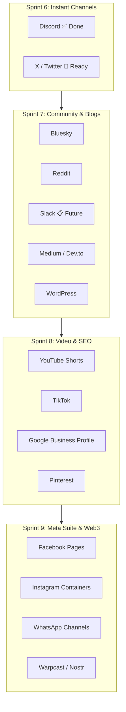

# 🌐 Scriora Social Platforms & Ecosystem Integrations: Master Architecture & Competitor Benchmark

> **System:** Scriora Multi-Platform Social Orchestration Layer (`@scriora/social`)  
> **Security Standard:** Zero-Trust Ingestion & AES-256-GCM Token Envelope Encryption  
> **Governance Standard:** Human-in-the-Loop (§14 Interactive Approvals) & Transactional Outbox Reliability  
> **Competitor Benchmarks:** Analyzed against **Buffer**, **Postiz**, **Ayrshare**, **Hootsuite**, and **Publer**.

---

## 📊 1. Master Competitor Feature Matrix (Scriora vs Buffer vs Postiz vs Ayrshare)

| Core Feature Area | Scriora OS | Buffer | Postiz | Ayrshare | Scriora Competitive Advantage |
|---|:---:|:---:|:---:|:---:|---|
| **Multi-Platform Publishing** | ✅ 33 Platforms | ⚠️ 11 Channels | ✅ 30 Platforms | ✅ 17 Platforms | Broadest coverage across Social, Communities, Dev Blogs & Web3 |
| **Transactional Outbox Engine** | ✅ Guaranteed Delivery | ⚠️ Standard Queue | ⚠️ Standard Redis | ⚠️ API-only | Zero lost posts via PostgreSQL Outbox + Inngest sweep |
| **Human-in-the-Loop (§14 Approvals)** | ✅ Interactive Mobile C2 | ⚠️ Team Approval (Web) | ❌ None | ❌ None | Telegram/Discord 1-click mobile approval before posts go live |
| **Media Pipeline Support** | ✅ Text, Photo, Video, PDF | ⚠️ Text, Photo, Video | ✅ Text, Photo, Video | ✅ Text, Photo, Video, PDF | Full PDF Document carousels (LinkedIn) + Discord Rich Embeds |
| **Direct Webhook Publishing** | ✅ 10-Second Setup | ❌ OAuth only | ⚠️ Discord/Slack only | ❌ OAuth only | Instant zero-credential channel publishing via Webhooks |
| **Comments & Community Inbox** | ⏳ Scheduled (Phase 11) | ✅ FB, IG, Threads | ⚠️ Basic Comments | ✅ Comments API | Planned AI auto-replies and sentiment analysis |
| **Direct Messaging (DM)** | ⏳ Scheduled (Phase 11) | ✅ Instagram DM | ❌ None | ⚠️ Webhooks only | Unified DM inbox for leads and customer support |
| **Model Context Protocol (MCP)** | ✅ Native (@scriora/mcp) | ❌ None | ⚠️ Basic Agent | ❌ None | Direct LLM tool use for Claude, Cursor, ChatGPT, and n8n |
| **Self-Hosted & Zero-Trust Cloud** | ✅ 100% On-Premise / Cloud | ❌ Closed SaaS | ✅ Open Source | ❌ Closed SaaS | Full data sovereignty with Row-Level Security (RLS) |

---

## 🗺️ 2. Comprehensive 33-Platform Integration Directory

### Category A: Core Social & Professional Networks
| # | Platform | Auth Mechanism | Scriora Status | Buffer | Postiz | Ayrshare | Primary Capabilities |
|---|---|---|:---:|:---:|:---:|:---:|---|
| 1 | **LinkedIn** | OAuth 2.0 (PKCE) | **✅ Production Live** | ✅ Yes | ✅ Yes | ✅ Yes | Personal & Org Pages, Articles, Multi-Image, PDF Carousels |
| 2 | **X (Twitter)** | OAuth 2.0 (PKCE) / API v2 | **🚀 Adapter Ready** | ✅ Yes | ✅ Yes | ✅ Yes | Tweets, Automated Thread Chaining, Images, Video, Polls |
| 3 | **Facebook** | Meta Graph API v20+ | **⏳ Phase 7** | ✅ Yes | ✅ Yes | ✅ Yes | Pages, Groups, Feed Posts, Reels, High-Res Video |
| 4 | **Instagram** | Meta Graph API (Containers) | **⏳ Phase 7** | ✅ Yes | ✅ Yes | ✅ Yes | Business/Creator Accounts, Reels, Carousels, Stories |
| 5 | **Threads** | Meta Threads API | **⏳ Phase 7** | ✅ Yes | ✅ Yes | ✅ Yes | 500-char posts, Carousels, Video, Public replies |
| 6 | **Pinterest** | OAuth 2.0 (API v5) | **⏳ Phase 8** | ✅ Yes | ✅ Yes | ✅ Yes | Visual Pins, Destination URLs, Board targeting |

---

### Category B: Direct Messaging, Communities & Chat
| # | Platform | Auth Mechanism | Scriora Status | Buffer | Postiz | Ayrshare | Primary Capabilities |
|---|---|---|:---:|:---:|:---:|:---:|---|
| 7 | **Telegram** | Bot API + C2 Webhook | **✅ Production Live** | ❌ No | ✅ Yes | ✅ Yes | Channels, Groups, C2 Admin Bot, §14 Approvals, Photos |
| 8 | **Discord** | Webhook / Bot API v10 | **✅ Production Live** | ❌ No | ✅ Yes | ❌ No | Rich Embeds, Webhooks, Bot API, Forums, Color cards |
| 9 | **Reddit** | OAuth 2.0 (Script App) | **📋 مؤجل (Postponed)** | ❌ No | ✅ Yes | ✅ Yes | Subreddit distribution, Markdown posts, Link shares |
| 10 | **Slack** | Webhook / Bot Token | **📋 مؤجل (Postponed)** | ❌ No | ✅ Yes | ❌ No | Block Kit JSON, Internal Announcements, Team Channels |
| 11 | **WhatsApp Channels** | Meta Cloud API | **⏳ Phase 8** | ❌ No | ❌ No | ✅ Yes | Verified Broadcast Channels, Media updates, Newsletters |

---

### Category C: Video, Creator & Streaming Platforms
| # | Platform | Auth Mechanism | Scriora Status | Buffer | Postiz | Ayrshare | Primary Capabilities |
|---|---|---|:---:|:---:|:---:|:---:|---|
| 12 | **YouTube** | Google OAuth 2.0 | **⏳ Phase 8** | ✅ Yes | ✅ Yes | ✅ Yes | Shorts, Long-form Video (Chunked Resumable), Community Posts |
| 13 | **TikTok** | Content Posting API | **⏳ Phase 8** | ✅ Yes | ✅ Yes | ✅ Yes | Short-form 9:16 Video, Direct Share, Duet/Stitch permissions |
| 14 | **Twitch** | OAuth 2.0 / EventSub | **⏳ Phase 9** | ❌ No | ✅ Yes | ❌ No | Stream go-live announcements, Community broadcasts |
| 15 | **Kick** | Bot / Webhook API | **⏳ Phase 9** | ❌ No | ✅ Yes | ❌ No | Creator live stream notifications, Channel alerts |
| 16 | **Dribbble** | OAuth 2.0 | **⏳ Phase 9** | ❌ No | ✅ Yes | ❌ No | Design shots, Agency portfolios, Visual showcases |
| 17 | **Skool** | Community API / Session | **⏳ Phase 9** | ❌ No | ✅ Yes | ❌ No | Education courses, Community posts, Student updates |
| 18 | **Whop** | Developer API | **⏳ Phase 9** | ❌ No | ✅ Yes | ❌ No | Creator product announcements, Membership posts |

---

### Category D: Business, Local SEO & Enterprise
| # | Platform | Auth Mechanism | Scriora Status | Buffer | Postiz | Ayrshare | Primary Capabilities |
|---|---|---|:---:|:---:|:---:|:---:|---|
| 19 | **Google Business Profile (GMB)** | Google Business API | **⏳ Phase 8** | ✅ Yes | ❌ No | ✅ Yes | Local SEO, Business updates, Offers, Events, Multi-location |

---

### Category E: Technical Blogging, CMS & Newsletters
| # | Platform | Auth Mechanism | Scriora Status | Buffer | Postiz | Ayrshare | Primary Capabilities |
|---|---|---|:---:|:---:|:---:|:---:|---|
| 20 | **WordPress** | REST API / App Password | **⏳ Phase 7** | ✅ Yes | ✅ Yes | ⚠️ Plugin | Direct blog post publishing, Featured images, SEO tags |
| 21 | **Medium** | Integration Token | **⏳ Phase 7** | ❌ No | ✅ Yes | ✅ Yes | Long-form technical articles, Markdown, Canonical URLs |
| 22 | **Dev.to** | API Key | **⏳ Phase 7** | ❌ No | ✅ Yes | ❌ No | Developer community articles, Markdown, Tags, Canonical |
| 23 | **Hashnode** | Personal Access Token | **⏳ Phase 7** | ❌ No | ✅ Yes | ❌ No | GraphQL publishing, Engineering blogs, Custom domains |
| 24 | **Substack (WriteStack)** | Webhook / API bridge | **⏳ Phase 8** | ✅ Yes | ❌ No | ❌ No | Substack Notes cross-posting, Newsletter publication |
| 25 | **Listmonk** | REST API + Basic Auth | **⏳ Phase 8** | ❌ No | ✅ Yes | ❌ No | Self-hosted email newsletter broadcasts, Campaign delivery |

---

### Category F: Open Web, Federated & Decentralized (Fediverse & Web3)
| # | Platform | Auth Mechanism | Scriora Status | Buffer | Postiz | Ayrshare | Primary Capabilities |
|---|---|---|:---:|:---:|:---:|:---:|---|
| 26 | **Bluesky** | AT Protocol (App Passwords) | **⏳ Phase 7** | ✅ Yes | ✅ Yes | ✅ Yes | Decentralized microblogging, Facets, Custom feeds |
| 27 | **Mastodon** | ActivityPub / REST Bearer | **⏳ Phase 7** | ✅ Yes | ✅ Yes | ✅ Yes | Federated posts, Content warnings, Media attachments |
| 28 | **Nostr** | Cryptographic Keys (NIP-01) | **⏳ Phase 9** | ❌ No | ✅ Yes | ❌ No | Cryptographic relay events, Censorship-resistant posts |
| 29 | **Warpcast (Farcaster)** | Signer UUID / Hubble Hub | **⏳ Phase 9** | ❌ No | ✅ Yes | ❌ No | Decentralized social casts, Frames, Web3 communities |
| 30 | **Lemmy** | ActivityPub API | **⏳ Phase 9** | ❌ No | ✅ Yes | ❌ No | Fediverse community posts, Discussion threads |
| 31 | **MeWe** | REST API | **⏳ Phase 9** | ❌ No | ✅ Yes | ❌ No | Privacy-focused social group broadcasting |
| 32 | **VK (VKontakte)** | VK API v5.x | **⏳ Phase 9** | ❌ No | ✅ Yes | ❌ No | Wall posts, Photos, Eastern European social network |

---

## 🔌 3. Ecosystem & Software Tools Directory (24 Benchmark Integrations)

Scriora is engineered to connect seamlessly with modern AI, cloud storage, automation, and design suites:

### 1. 🤖 AI & Intelligent Agents
* **Claude (Anthropic):** Native MCP server integration to inspect queues, draft posts, and invoke outbox dispatches directly from Claude Desktop / Chat.
* **ChatGPT & OpenAI:** GPT Actions / Assistants API integration for automatic drafting, repurposing, and translations.
* **Cursor:** Direct codebase / workflow trigger via `@scriora/mcp` extension.
* **Perplexity Web:** Automated research grounding and source citation for planned content drafts.

### 2. ⚡ Automation & Workflow Orchestrators
* **Zapier:** Connect Scriora to 7,000+ business applications via trigger/action endpoints.
* **Make (Integromat):** Visual automation scenarios (e.g. RSS -> Scriora -> Multi-channel publish).
* **n8n:** Self-hosted workflow builder with native Scriora HTTP nodes.
* **Microsoft Power Automate:** Enterprise compliance, Teams notifications, and SharePoint ingestion.
* **IFTTT:** Simple conditional triggers for smart home and personal devices.
* **Raycast:** MacOS command bar extension for 1-click post scheduling and queue inspection.

### 3. 🎨 Design & Content Creation
* **Canva:** Embed Canva Design Button to create graphics directly within the Scriora Composer.
* **Unsplash:** In-app royalty-free stock image search and 1-click attachment.

### 4. ☁️ Cloud Media & Storage
* **Google Drive & Google Photos:** Stream cloud media directly into social posts without local downloads.
* **Dropbox:** High-resolution asset syncing for marketing teams.
* **Microsoft OneDrive:** Corporate OneDrive & SharePoint media picker.

### 5. 📰 Publishing & Content Curation
* **Bitly:** Automatic link shortening and UTM campaign click tracking.
* **WordPress & Nelio Content:** Auto-publish social posts whenever a new blog article is published.
* **Feedly:** Curate industry trends and queue relevant insights directly to social channels.
* **Quuu & Evergreen Content Poster:** Reshare evergreen content to keep social channels perpetually active.
* **WriteStack:** Schedule Substack Notes and cross-post to social channels simultaneously.

---

## 🎯 4. Integration Execution Sprints (Ordered by Velocity)

