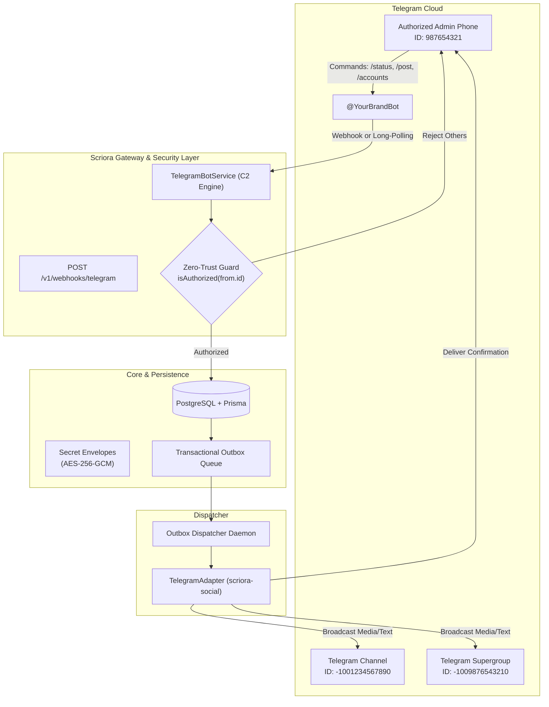

# 📱 Telegram Omnichannel & C2 Admin Bot Integration Guide

> **Status:** Production-Ready | **Module:** `scriora-social`, `scriora-api`, `scriora-worker`  
> **Security Level:** Zero-Trust Encrypted (AES-256-GCM Envelope)  
> **Governance:** Human-in-the-Loop (§14 Interactive Approvals)

---

## 1. 🌐 Overview & Architectural Topology

Scriora treats Telegram as both a **multi-destination publication platform** (Private Chat, Public/Private Channels, Supergroups/Forums) and a **real-time Command & Control (C2) remote management console**.



---

## 2. 📋 What We Need from the User (ما نحتاجه من المستخدم خطوة بخطوة)

لربط تيليجرام بنجاح في مساحة العمل والاستفادة من النشر متعدد الوجهات والتحكم المركزي، يحتاج المستخدم إلى تزويد المنصة بثلاثة عناصر أساسية فقط:

### 1. توكن البوت (Bot Token) 🤖
* **التعريف:** المفتاح السري الذي يسمح لـ Scriora بإرسال المنشورات واستقبال الأوامر والاعتمادات.
* **كيف يحصل عليه المستخدم:**
  1. يفتح تطبيق تيليجرام ويبحث عن البوت الرسمي: [@BotFather](https://t.me/BotFather).
  2. يرسل الأمر: `/newbot`.
  3. يحدد اسماً للبوت (مثلاً: `My Company Publisher`) واسم مستخدم ينتهي بـ `bot` (مثلاً: `my_company_pub_bot`).
  4. يقوم بنسخ الـ **HTTP API Token** (يبدو بهذا الشكل: `123456789:ABCdefGHIjklMNOpqrsTUVwxyz`).
* **أين يُدخل في Scriora:** في معالج الربط بالواجهة أو حقل `botToken` في طلب `POST /v1/connect/telegram`.

---

### 2. معرّف وجهة النشر (Destination / Chat ID) 📢
Scriora تدعم النشر في كافة أنواع المحادثات والقنوات دون الحاجة لإرسال رسائل عشوائية:

#### أ. القنوات العامة (Public Channels)
* **المطلوب:** معرف القناة العام فقط (مثال: `@my_channel` أو رابط `t.me/my_channel`).
* **صلاحية البوت:** إضافة البوت إلى القناة كـ **مشرف (Administrator)** وتفعيل صلاحية وحيدة: **نشر الرسائل (Post Messages)**.
* **الحصول على المعرف:** لا حاجة لأي رقم سالب! يكفي كتابة اسم المستخدم العام مثل `@my_company_news`.

#### ب. القنوات الخاصة (Private Channels)
* **المطلوب:** المعرف الرقمي السالب (يبدأ بـ `-100...` مثل `-1001234567890`).
* **صلاحية البوت:** مشرف (Administrator) بصلاحية **نشر الرسائل (Post Messages)** فقط.
* **كيفية استخراج المعرف مباشرة وبسهولة:**
  1. **الطريقة الأولى (الأسهل عبر @userinfobot):**
     * قم بإعادة توجيه (Forward) أي رسالة من القناة الخاصة إلى البوت الشهير [@userinfobot](https://t.me/userinfobot) (https://t.me/userinfobot).
     * سيرد عليك البوت فوراً بالمعرف: `Forwarded from chat ID: -1001234567890`.
  2. **الطريقة الثانية (عبر متصفح الويب Telegram Web):**
     * افتح القناة عبر [web.telegram.org](https://web.telegram.org).
     * انظر إلى شريط العنوان في المتصفح، ستجد الرابط بالشكل: `https://web.telegram.org/a/#-1001234567890`. انسخ الرقم `-1001234567890` مباشرة.

#### ج. المجموعات والمنتديات (Supergroups & Forums)
* **المطلوب:** معرّف المجموعة السالب (مثال: `-1009876543210`).
* **صلاحية البوت:** عضو عادي أو مشرف بصلاحية **إرسال الرسائل (Send Messages)** فقط.
* **كيفية استخراج المعرف مباشرة:**
  1. أضف [@userinfobot](https://t.me/userinfobot) إلى المجموعة مؤقتاً وسيعرض لك المعرف فوراً ثم احذفه.
  2. أو قم بإعادة توجيه (Forward) رسالة من المجموعة إلى [@userinfobot](https://t.me/userinfobot).
  3. أو انسخ المعرف من رابط المتصفح في Telegram Web.

#### د. المحادثات المباشرة (Direct Personal Chat)
* يفتح المستخدم رابط البوت في تيليجرام ويضغط على زر `/start`.

---

### 3. معرّف حساب المدير للتحكم والاعتماد (Admin Telegram ID) 🛡️
* **التعريف:** رقم الـ User ID الخاص بحساب تيليجرام الشخصي للمدير أو المسؤول التنفيذي.
* **الغرض الأمني (Zero-Trust Whitelist):**
  * حصر استلام بطاقات الموافقة البشرية التفاعلية بنقرة واحدة (§14 Governance).
  * حصر تنفيذ أوامر الكونسول الحساسة (`/status`, `/accounts`, `/post`) على رقمه، وحظر وتجاهل أي شخص آخر.
* **كيف يحصل عليه المستخدم في 5 ثوانٍ:**
  * يفتح البوت الرسمي [@userinfobot](https://t.me/userinfobot) (https://t.me/userinfobot) ويضغط `/start`.
  * يظهر له معرف حسابه فوراً: `Id: 987654321`.
* **أين يُحفظ:** في متغير البيئة `TELEGRAM_ADMIN_CHAT_ID` أو إعدادات مساحة العمل في لوحة التحكم.

---

### 4. 🛡️ بيان الصلاحيات والخصوصية الصارمة (Zero-Trust Permissions Policy)

تلتزم منصة Scriora بأعلى معايير الخصوصية والأمان الإفصاحي الصارم للعملاء:

| الصلاحية | مطلوب للبوت؟ | الغرض التقني |
|---|:---:|---|
| **نشر الرسائل (Post Messages)** | ✅ نعم | لنشر التحديثات المعتمدة فقط في القنوات والمجموعات |
| **قراءة الرسائل ومحادثات الأعضاء** | ❌ **مرفوض قطعاً** | خاصية Privacy Mode مفعلة؛ لا يمكن للبوت قراءة محادثاتك |
| **إضافة أو حذف مشرفين آخرين** | ❌ **غير مطلوب** | لا تطلب المنصة أي صلاحيات إدارية عليا |
| **حذف رسائل الأعضاء الآخرين** | ❌ **غير مطلوب** | المنصة لا تحذف ولا تعدل رسائل أي شخص آخر |
| **الوصول للأسماء أو جهات الاتصال** | ❌ **مستحيل تقنياً** | لا يملك البوت أي وصول لجهات الاتصال الخاصة بالمستخدم |

---

### 5. 🎨 التخصيص الكامل لرسائل وأزرار الاعتماد (Customizable Approval Cards & Buttons)

تتيح منصة Scriora للمستخدم وفريق العمل **تخصيص كافة نصوص بطاقة الاعتماد وأزرارها** لتلائم لغة وهوية الفريق:

```typescript
// تخصيص بطاقة الاعتماد التفاعلية (§14)
await telegramBotService.sendApprovalRequest({
  chatId: "987654321",
  approvalId: "app_123",
  token: "token_secure_xyz",
  title: "حملة إطلاق المنتج الجديد",
  body: "يسرنا إطلاق النسخة التجريبية اليوم لجميع عملائنا!",
  platform: "TELEGRAM",
  
  // 1. تخصيص عنوان ومقدمة الرسالة:
  customHeader: "✨ <b>طلب موافقة فريق التسويق قبل النشر:</b>",
  
  // 2. تخصيص نص زر الموافقة:
  approveButtonText: "🚀 موافقة ونشر الآن",
  
  // 3. تخصيص نص زر الرفض:
  rejectButtonText: "🛑 رفض وتعديل المحتوى",
  
  // 4. تخصيص تذييل الرسالة:
  customFooter: "يرجى مراجعة الصياغة والتأكيد من هاتفك.",
});
```

* **دعم اللغات المختلفة:** يمكن ضبط الأزرار بالعربية (`نشر الآن` / `رفض وإلغاء`) أو الإنجليزية (`Approve & Deploy` / `Decline`) أو أي نص مخصص.
* **تأكيد القرار التفاعلي:** عند نقر الزر، يتم تحديث الرسالة فوراً بالنص المخصص مع عرض اسم المشرف الذي اتخذ القرار وتوقيته.

## 3. 🔐 Zero-Trust Security & Key Encryption

All Telegram credentials, bot tokens, and destination identifiers are stored in PostgreSQL using **AES-256-GCM Envelope Encryption** (`secret_envelopes` table).

* **Master Key:** Sourced from `MASTER_ENCRYPTION_KEY` (32 bytes hex-encoded).
* **Cryptographic Vector:** Every envelope generates a fresh 96-bit (12-byte) initialization vector (`IV`) and a 128-bit authentication tag (`authTag`).
* **Authorized Caller Whitelist:** The C2 engine enforces `isAuthorized(senderId)`. Any user outside the configured `TELEGRAM_ADMIN_CHAT_ID` receives a rejection notification and cannot trigger actions.

```typescript
// packages/social/src/platforms/telegram/telegram-bot.service.ts
public isAuthorized(senderId: string | number): boolean {
  if (!this.adminChatId) return true;
  return String(senderId) === this.adminChatId;
}
```

---

## 4. 🎯 Multi-Destination Ingestion & Mapping

Telegram separates targets into distinct chat types:

| Target Type | External Account ID Format | Bot Permissions Needed | Example Record in DB |
|---|---|---|---|
| **Private Chat** | Positive integer (e.g. `987654321`) | None (User initiates `/start`) | `Ameer (@YourTelegramHandle)` |
| **Public Channel** | Public username (e.g. `@my_channel`) | Admin (`can_post_messages`) | `Channel - @my_channel` |
| **Private Channel** | Negative 13-digit integer (`-100...`) | Admin (`can_post_messages`) | `Channel - -1001234567890` |
| **Supergroup / Forum** | Negative 13-digit integer (`-100...`) | Member / Admin (`can_send_messages`) | `Group - -1009876543210` |

### Connection Endpoint
To attach any Telegram destination to a workspace, call:
```http
POST /v1/connect/telegram
Content-Type: application/json
x-workspace-id: 4d2e70c7-3010-4d17-b3d8-cca91b5edbc6

{
  "botToken": "YOUR_BOT_TOKEN",
  "chatId": "-1001234567890",
  "channelTitle": "قناة تيليجرام الرسمية"
}
```

---

## 5. 🎮 Interactive Admin Commands (C2 Bot)

The authorized administrator can manage Scriora directly from the Telegram chat interface:

| Command | Action | System Response |
|---|---|---|
| `/start` or `/help` | Displays interactive onboarding menu | Available command list and security status badge |
| `/status` | Real-time health check | Workspace name, connected platforms, outbox queue size |
| `/accounts` | Lists connected destinations | Displays all active LinkedIn, Channel, and Group accounts |
| `/post <text>` | **Chat-to-Publish** | Publishes post with media to all connected destinations in parallel |

---

## 6. 🛡️ Two-Way Human Governance (§14 Approvals)

When a post is scheduled by an AI agent or requires human validation before going live (`requiresApproval = true`):

1. Scriora issues a secure `ApprovalToken` (72h expiration, single-use SHA-256 hash).
2. `TelegramBotService.sendApprovalRequest` sends a rich preview card to the administrator's phone:

```text
🛡️ طلب اعتماد منشور جديد (Human Governance §14)

📋 المنصة: TELEGRAM & LINKEDIN
🏷️ العنوان: إعلان إطلاق المنتج الجديد
⚡ الموعد: فوري عند الاعتماد

📝 نص المنشور:
> نعلن اليوم عن إطلاق الإصدار الثاني من سكريورا للأتمتة الذكية...

[ ✅ اعتماد ونشر فوري ]  [ ❌ رفض وإلغاء ]
```

3. When the user taps **[ ✅ اعتماد ونشر فوري ]**:
   - The bot receives a `callback_query` (`approve:<token>`).
   - The token is verified and marked consumed (`usedAt = now()`).
   - The publication state transitions to `READY`.
   - The Outbox Dispatcher fires immediately, publishing across all channels.
   - The Telegram message dynamically updates to display: `القرار المتخذ: ✅ تم الاعتماد والنشر بنجاح 🚀`.

---

## 7. ⚙️ Operating Modes: Webhook vs Long-Polling

Scriora supports two operational modes:

### Mode A: Production Webhook (`apps/api`)
- Endpoint: `POST /v1/webhooks/telegram`
- Validates `x-telegram-bot-api-secret-token` against `TELEGRAM_WEBHOOK_SECRET`.
- Configured once via:
  ```bash
  curl -F "url=https://api.yourdomain.com/v1/webhooks/telegram" \
       -F "secret_token=YOUR_WEBHOOK_SECRET" \
       https://api.telegram.org/bot<TOKEN>/setWebhook
  ```

### Mode B: Standalone / Development Long-Polling Daemon
- Runs locally without requiring public domain or tunnel:
  ```bash
  node --env-file=.env scratch/run_telegram_c2_daemon.mjs
  ```
- Continuously polls `getUpdates` with adaptive timeout and zero message drop.

---

## 8. 🧪 Verification & Test Suite

Scriora includes dedicated unit and integration tests:

```bash
# Run unit tests in scriora-social
pnpm --filter scriora-social test

# Run API gateway tests
pnpm --filter scriora-api test

# Full typecheck across the monorepo
pnpm turbo run typecheck
```
