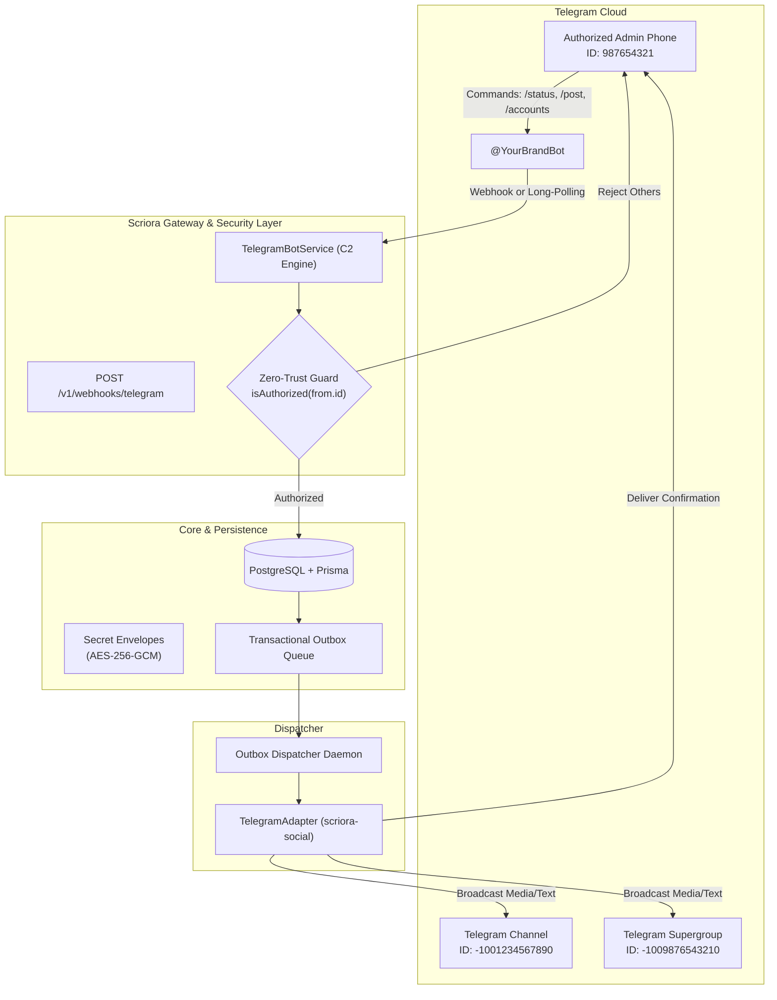

# 📱 Telegram Omnichannel & C2 Admin Bot Integration Guide

> **Status:** Production-Ready | **Module:** `scriora-social`, `scriora-api`, `scriora-worker`  
> **Security Level:** Zero-Trust Encrypted (AES-256-GCM Envelope)  
> **Governance:** Human-in-the-Loop (§14 Interactive Approvals)

---

## 1. 🌐 Overview & Architectural Topology

Scriora treats Telegram as both a **multi-destination publication platform** (Private Chat, Public/Private Channels, Supergroups/Forums) and a **real-time Command & Control (C2) remote management console**.



---

## 2. 📋 What We Need from the User (Step-by-Step Onboarding)

To connect Telegram to a workspace and enable multi-destination publishing and centralized mobile C2 governance, the user only needs to provide three elements:

### 1. Bot Token 🤖
* **Definition:** The secret API key that authorizes Scriora to broadcast content, register webhook events, and receive governance commands.
* **How to Obtain:**
  1. Open Telegram and search for the official [@BotFather](https://t.me/BotFather).
  2. Send the command: `/newbot`.
  3. Enter a display name for the bot (e.g. `Acme Content Publisher`) and a unique username ending in `bot` (e.g. `acme_content_pub_bot`).
  4. Copy the **HTTP API Token** (format: `123456789:ABCdefGHIjklMNOpqrsTUVwxyz`).
* **Where to Enter:** In the workspace settings under **Connect Telegram** or via API endpoint `POST /v1/connect/telegram`.

---

### 2. Destination ID (Target Chat ID) 📢
Scriora supports direct publishing across all chat and channel topologies without requiring random test messages:

#### A. Public Channels
* **Required Input:** Public channel username directly (e.g. `@my_brand_channel` or `t.me/my_brand_channel`).
* **Bot Permission:** Add the bot as an **Administrator** with only one permission enabled: **"Post Messages"**.
* **Discovery:** No negative ID is needed; the system automatically resolves the public username.

#### B. Private Channels
* **Required Input:** Negative 13-digit integer ID (starts with `-100...`, e.g. `-1001234567890`).
* **Bot Permission:** Add the bot as an **Administrator** with **"Post Messages"** permission only.
* **Direct ID Discovery (Instant & Painless):**
  1. **Method 1 (Fastest via [@userinfobot](https://t.me/userinfobot)):**
     * Forward any post from the private channel to [@userinfobot](https://t.me/userinfobot) (https://t.me/userinfobot).
     * The bot immediately replies with: `Forwarded from chat ID: -1001234567890`.
  2. **Method 2 (Via Telegram Web):**
     * Open the channel in your browser at [web.telegram.org](https://web.telegram.org).
     * Inspect the URL in your browser address bar: `https://web.telegram.org/a/#-1001234567890`. Copy the `-1001234567890` string directly.

#### C. Supergroups & Forums
* **Required Input:** Negative group ID (e.g. `-1009876543210`).
* **Bot Permission:** Member or Administrator with **"Send Messages"** permission only.
* **Direct ID Discovery:**
  1. Add [@userinfobot](https://t.me/userinfobot) (https://t.me/userinfobot) to the group temporarily; it outputs the Group ID immediately, then remove it.
  2. Alternatively, forward any message from the group to [@userinfobot](https://t.me/userinfobot).
  3. Or copy the group ID directly from the Telegram Web URL bar.

#### D. Direct Personal Chat
* The administrator opens the bot directly in Telegram and taps **Start** (`/start`).

---

### 3. Admin User ID (C2 & Governance Whitelist) 🛡️
* **Definition:** The numeric Telegram User ID belonging to the executive administrator.
* **Security Function (Zero-Trust Whitelist):**
  * Restricts delivery of interactive Human Governance approval cards (§14).
  * Exclusively authorizes C2 management commands (`/status`, `/accounts`, `/post`), blocking all unauthorized senders.
* **Instant Discovery (5 Seconds):**
  * Open the official [@userinfobot](https://t.me/userinfobot) (https://t.me/userinfobot) on Telegram and send `/start`.
  * The bot outputs your numerical User ID instantly (e.g. `Id: 987654321`).
* **Storage:** Configured in `TELEGRAM_ADMIN_CHAT_ID` or workspace settings.

---

### 4. 🛡️ Least-Privilege & Zero-Trust Permissions Policy

Scriora strictly enforces the principle of least privilege across all integrated bots:

| Permission | Requested by Scriora? | Operational Justification |
|---|:---:|---|
| **Post Messages** | ✅ Yes | Required solely to publish approved content to target channels |
| **Read Member Messages** | ❌ **Strictly Prohibited** | Group Privacy Mode is enabled; the bot cannot access chat history |
| **Add / Remove Administrators** | ❌ **Not Requested** | Scriora does not request or require elevated channel administrative rights |
| **Delete Others' Messages** | ❌ **Not Requested** | Scriora never modifies or deletes third-party messages |
| **Access User Contacts / Personal Data** | ❌ **Technically Impossible** | Telegram Bot API does not expose user contact lists or private information |

---

### 5. 🎨 Customizable Approval Cards & Action Buttons

Scriora provides workspace administrators with **complete customization of approval card content and action button labels**:

```typescript
// Customizing an interactive Human Governance card (§14)
await telegramBotService.sendApprovalRequest({
  chatId: "987654321",
  approvalId: "app_123",
  token: "token_secure_xyz",
  title: "New Product Launch Announcement",
  body: "We are thrilled to unveil our v2.0 platform upgrade today!",
  platform: "TELEGRAM",

  // 1. Custom header text:
  customHeader: "✨ <b>Marketing Team Review Gate:</b>",

  // 2. Custom approve button label:
  approveButtonText: "🚀 Publish to All Channels",

  // 3. Custom reject button label:
  rejectButtonText: "🛑 Decline & Revise Draft",

  // 4. Custom footer instructions:
  customFooter: "Review copy and tap below to authorize instant dispatch.",
});
```

* **Multi-Language Support:** Configure buttons in English (`Publish Now` / `Reject`), Arabic (`نشر فوري` / `رفض وإلغاء`), or custom enterprise formats.
* **Dynamic Decision Receipts:** Upon button tap, the message in Telegram edits in-place to display the decision outcome and the reviewer's username.

## 3. 🔐 Zero-Trust Security & Key Encryption

All Telegram credentials, bot tokens, and destination identifiers are stored in PostgreSQL using **AES-256-GCM Envelope Encryption** (`secret_envelopes` table).

* **Master Key:** Sourced from `MASTER_ENCRYPTION_KEY` (32 bytes hex-encoded).
* **Cryptographic Vector:** Every envelope generates a fresh 96-bit (12-byte) initialization vector (`IV`) and a 128-bit authentication tag (`authTag`).
* **Authorized Caller Whitelist:** The C2 engine enforces `isAuthorized(senderId)`. Any user outside the configured `TELEGRAM_ADMIN_CHAT_ID` receives a rejection notification and cannot trigger actions.

```typescript
// packages/social/src/platforms/telegram/telegram-bot.service.ts
public isAuthorized(senderId: string | number): boolean {
  if (!this.adminChatId) return true;
  return String(senderId) === this.adminChatId;
}
```

---

## 4. 🎯 Multi-Destination Ingestion & Mapping

Telegram separates targets into distinct chat types:

| Target Type | External Account ID Format | Bot Permissions Needed | Example Record in DB |
|---|---|---|---|
| **Private Chat** | Positive integer (e.g. `987654321`) | None (User initiates `/start`) | `Ameer (@YourTelegramHandle)` |
| **Public Channel** | Public username (e.g. `@my_channel`) | Admin (`can_post_messages`) | `Channel - @my_channel` |
| **Private Channel** | Negative 13-digit integer (`-100...`) | Admin (`can_post_messages`) | `Channel - -1001234567890` |
| **Supergroup / Forum** | Negative 13-digit integer (`-100...`) | Member / Admin (`can_send_messages`) | `Group - -1009876543210` |

### Connection Endpoint
To attach any Telegram destination to a workspace, call:
```http
POST /v1/connect/telegram
Content-Type: application/json
x-workspace-id: 4d2e70c7-3010-4d17-b3d8-cca91b5edbc6

{
  "botToken": "YOUR_BOT_TOKEN",
  "chatId": "-1001234567890",
  "channelTitle": "قناة تيليجرام الرسمية"
}
```

---

## 5. 🎮 Interactive Admin Commands (C2 Bot)

The authorized administrator can manage Scriora directly from the Telegram chat interface:

| Command | Action | System Response |
|---|---|---|
| `/start` or `/help` | Displays interactive onboarding menu | Available command list and security status badge |
| `/status` | Real-time health check | Workspace name, connected platforms, outbox queue size |
| `/accounts` | Lists connected destinations | Displays all active LinkedIn, Channel, and Group accounts |
| `/post <text>` | **Chat-to-Publish** | Publishes post with media to all connected destinations in parallel |

---

## 6. 🛡️ Two-Way Human Governance (§14 Approvals)

When a post is scheduled by an AI agent or requires human validation before going live (`requiresApproval = true`):

1. Scriora issues a secure `ApprovalToken` (72h expiration, single-use SHA-256 hash).
2. `TelegramBotService.sendApprovalRequest` sends a rich preview card to the administrator's phone:

```text
🛡️ New Content Approval Request (Human Governance §14)

📋 Platform: TELEGRAM & LINKEDIN
🏷️ Title: Product Launch Announcement
⚡ Schedule: Immediate upon approval

📝 Post Content:
> We are thrilled to unveil our v2.0 platform upgrade today...

[ 🚀 Publish to All Channels ]  [ 🛑 Decline & Revise Draft ]
```

3. When the user taps **[ 🚀 Publish to All Channels ]**:
   - The bot receives a `callback_query` (`approve:<token>`).
   - The token is verified and marked consumed (`usedAt = now()`).
   - The publication state transitions to `READY`.
   - The Outbox Dispatcher fires immediately, publishing across all channels.
   - The Telegram message dynamically updates to display: `Decision Recorded: ✅ Approved and Published Successfully 🚀`.

---

## 7. ⚙️ Operating Modes: Webhook vs Long-Polling

Scriora supports two operational modes:

### Mode A: Production Webhook (`apps/api`)
- Endpoint: `POST /v1/webhooks/telegram`
- Validates `x-telegram-bot-api-secret-token` against `TELEGRAM_WEBHOOK_SECRET`.
- Configured once via:
  ```bash
  curl -F "url=https://api.yourdomain.com/v1/webhooks/telegram" \
       -F "secret_token=YOUR_WEBHOOK_SECRET" \
       https://api.telegram.org/bot<TOKEN>/setWebhook
  ```

### Mode B: Standalone / Development Long-Polling Daemon
- Runs locally without requiring public domain or tunnel:
  ```bash
  node --env-file=.env scratch/run_telegram_c2_daemon.mjs
  ```
- Continuously polls `getUpdates` with adaptive timeout and zero message drop.

---

## 8. 🧪 Verification & Test Suite

Scriora includes dedicated unit and integration tests:

```bash
# Run unit tests in scriora-social
pnpm --filter scriora-social test

# Run API gateway tests
pnpm --filter scriora-api test

# Full typecheck across the monorepo
pnpm turbo run typecheck
```

---

## 9. 🖼️ Media & Image Upload Architecture

Scriora supports rich media across three distinct tiers:

### 1. Web Dashboard (Phase 10 - End-User Experience)
* **Drag-and-Drop Composer:** Users upload images (PNG, JPG, WebP) or videos directly from their desktop.
* **Storage Engine:** Assets are securely uploaded to Supabase Storage / S3 buckets with automated thumbnail generation.
* **Omnichannel Preview:** Real-time visual mockup showing how the image renders on Telegram channels, LinkedIn feed, X cards, and Instagram grids before publishing.

### 2. REST API Pipeline (`POST /v1/posts`)
* Programmatic dispatch accepts `mediaUrls: string[]` (up to 10 media assets):
  ```json
  {
    "contentDraft": {
      "title": "Launch Update",
      "body": "Check out our new feature!",
      "mediaUrls": ["https://cdn.yourdomain.com/uploads/banner.png"]
    },
    "platforms": ["TELEGRAM", "LINKEDIN"]
  }
  ```

### 3. Mobile Telegram C2 Upload
* The administrator can send a photo directly from their smartphone gallery to the C2 bot with a caption; the bot processes and broadcasts the photo across all connected workspace channels.
